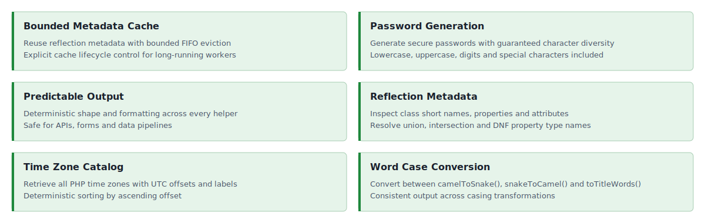

<!-- markdownlint-disable MD041 -->
<p align="center">
    <picture>
        
    </picture>
    <h1 align="center">PHP Helper</h1>
    <br>
</p>
<!-- markdownlint-enable MD041 -->

<p align="center">
    <a href="https://github.com/php-forge/helper/actions/workflows/build.yml" target="_blank">
        
    </a>
    <a href="https://dashboard.stryker-mutator.io/reports/github.com/php-forge/helper/main" target="_blank">
        
    </a>
    <a href="https://github.com/php-forge/helper/actions/workflows/static.yml" target="_blank">
        
    </a>
</p>

<p align="center">
    <strong>Small, focused helpers for common PHP tasks</strong><br>
    <em>Convert word casing, inspect metadata, generate passwords, and list time zones with predictable output.</em>
</p>

## Features

<picture>
    <source media="(max-width: 767px)" srcset="./docs/svgs/features-mobile.svg">
    
</picture>

### Installation

```bash
composer require php-forge/helper:^0.3
```

### Quick start

#### Convert camelCase to snake_case

```php
<?php

declare(strict_types=1);

namespace App;

use PHPForge\Helper\WordCaseConverter;

$word = WordCaseConverter::camelToSnake('dateBirth');
// date_birth
```

#### Convert snake_case to camelCase

```php
<?php

declare(strict_types=1);

namespace App;

use PHPForge\Helper\WordCaseConverter;

$word = WordCaseConverter::snakeToCamel('date_birth');
// dateBirth
```

#### Convert text to title words

```php
<?php

declare(strict_types=1);

namespace App;

use PHPForge\Helper\WordCaseConverter;

$word = WordCaseConverter::toTitleWords('dateOfMessage');
// Date Of Message
```

#### Generate passwords

```php
<?php

declare(strict_types=1);

namespace App;

use PHPForge\Helper\PasswordGenerator;

$password = PasswordGenerator::generate(12);
// for example, aB3#kL9!mN2@
```

#### Retrieve all time zones

```php
<?php

declare(strict_types=1);

namespace App;

use PHPForge\Helper\TimeZoneList;

$timezones = TimeZoneList::all();
// [['timezone' => 'Pacific/Midway', 'name' => 'Pacific/Midway (UTC -11:00)', 'offset' => -39600], ...]
```

#### Inspect class metadata with Reflector

```php
<?php

declare(strict_types=1);

namespace App;

use PHPForge\Helper\Reflector;

$shortName = Reflector::shortName(\App\Domain\User::class);
$types = Reflector::propertyTypeNames(\App\Domain\User::class, 'email');
$attributes = Reflector::propertyAttributes(\App\Domain\User::class, 'email');
```

## Documentation

For detailed configuration options and advanced usage.

- 📚 [Installation Guide](docs/installation.md)
- 💡 [Usage Examples](docs/examples.md)
- 🧪 [Testing Guide](docs/testing.md)

## Package information

[](https://www.php.net/releases/8.3/en.php)
[](https://packagist.org/packages/php-forge/helper)
[](https://packagist.org/packages/php-forge/helper)

## Quality code

[](https://codecov.io/github/php-forge/helper)
[](https://github.com/php-forge/helper/actions/workflows/static.yml)
[](https://github.styleci.io/repos/667051036?branch=main)

## Our social networks

[](https://x.com/Terabytesoftw)
[](https://www.facebook.com/wilmer.arambula.9)
[](https://www.reddit.com/r/Yii2/)
[](https://t.me/yii_framework_in_english)
[](https://www.linkedin.com/groups/1483367/)

## License

[](LICENSE)
